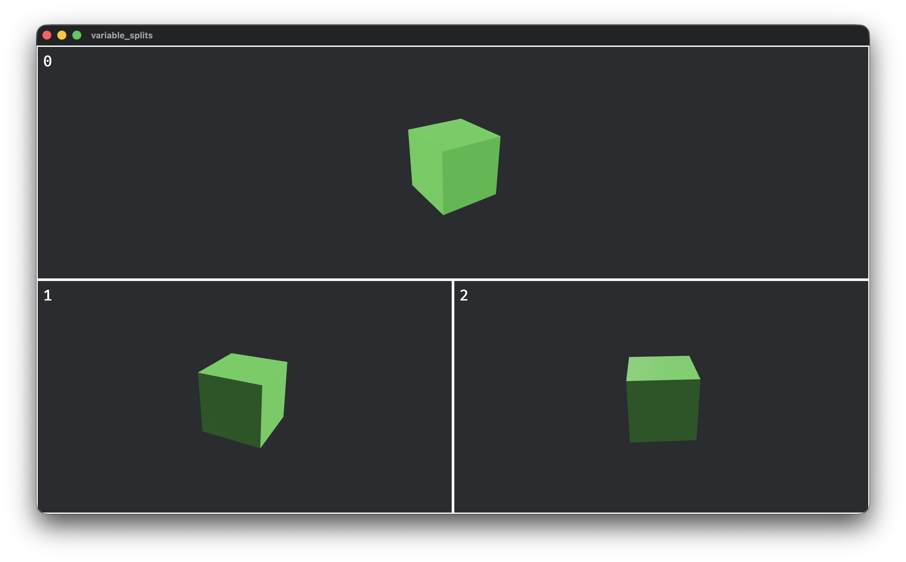

# Bevy Split Screen

A library for adding split screen support to [Bevy](https://bevy.org/) games. 

## Getting Started

For Bevy 0.19, add split screen to your project with:

```toml
[dependencies]
bevy_split_screen = "0.1.0"
```

To make a camera display in a split, add the `SplitScreenCamera` to your `Camera` entities with a `player_index`. Resizing and assigning viewports is handled automatically.

To customize the layout of each split, implement the `SplitScreenLayout` and pass it to the `CustomSplitScreenPlugin`.

To see how to use it in your game, check out the [example](./examples/variable_splits.rs).

Here's what it looks like using the `DefaultSplitScreenLayout`:


## Supported Bevy Version

| bevy_split_screen | Bevy |
|-------------------|------|
| 0.1.0             | 0.19 |
